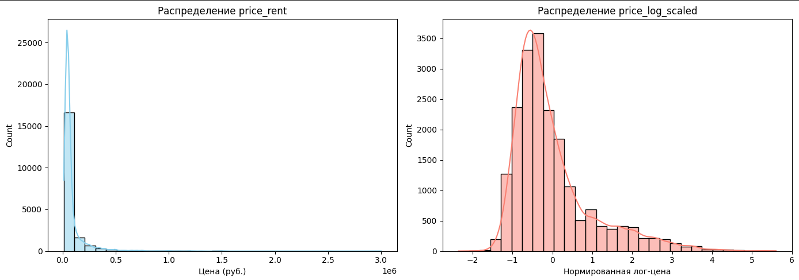
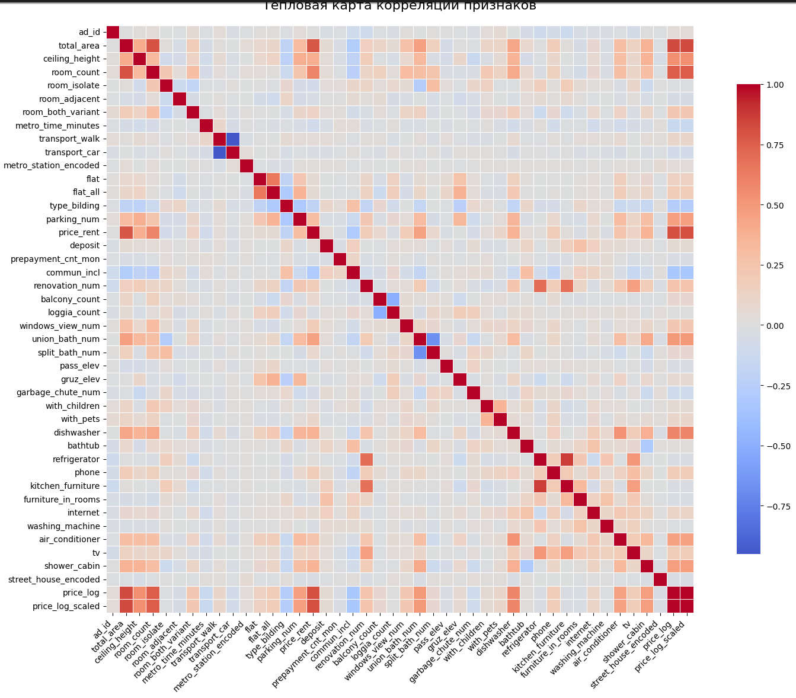

# Релиз 1.0: Разведочный анализ данных (EDA)

Подготовка датасета для модели предсказания стоимости аренды квартир в Москве.  
Исходные данные предоставлены дата-инженерами. Цель анализа — оценить качество данных и выявить особенности, влияющие на целевую переменную (арендная цена), чтобы в дальнейшем достичь MAPE ≤ 30%.

В этом релизе:
- Проведён EDA исходного датасета
- Выявлены проблемы: выбросы, пропуски, объявления не из Москвы
- Проанализированы зависимости цены от площади, количества комнат, ремонта и других признаков
- Сформированы рекомендации по очистке и преобразованию данных

### Состав релиза 1
- `README.md` — описание задачи и содержимого релиза  
- `EDA.html` — финальный отчёт с визуализациями и выводами  
- `EDA.ipynb` — Jupyter Notebook с кодом и анализом

# Релиз 2.0: Очистка данных от пропусков
В датафрейме присутствуют не тлько объявления квартир из Москвы. Удалаяем все немосковсие квартиры.
Исходные данные имеют пропуски (15 колонок). Удалены следующие колонки:
- 'Серия дома'(89.41%), 'Название ЖК'(77.42) - значительное количество пропусков
- 'Телефоны', 'Ссылка на объявление' - не информативны

Для обработки пропущенных значений выделены 3 признака:
 - адрес (улица + дом)
 - количество комнат
 - общая площадь

Выполнена обработка пропущенных значений, с использованием группировки по признакам (адрес, количество комнат, площадь с выборкой моды(для строковых) или медианы(для  числовых - Количество комнат)):
Примеры признаков с высоким уровнем пропусков до обработки:

    Парковка: 56.61%  - восстановлено по адресу квартир в датафрейме, остатки не указано
    Мусоропровод: 40.57%  - восстановлено по адресу квартир в датафрейме, остатки не указано
    Площадь комнат, м²: 36.62%  восстановлено по адресу квартир в датафрейме + количество комнат, остатки не указано
    Балкон: 33.59%  - восстановлено по адресу квартир в датафрейме + количество комнат, остатки не указано
    Окна: 26.09%    - восстановлено по адресу квартир в датафрейме + количество комнат, остатки не указано
    Можно с детьми/животными: 24.90%  - константа не указано
    Лифт: 21.24%  -  восстановлено по адресу квартир в датафрейме, остатки не указано
    Ремонт: 12.48%  - константа не указано
    Санузел: 10.34%  - восстановлено по адресу квартир в датафрейме+ количество комнат, остатки константа есть
    Метро:   восстановлено по адресу квартир в датафрейме, остатки не указано 

В этом релизе:
- проведен доп анализ ценности колонок, удалены ненужные
- заполнены пропуски
- Названия столбцов преобразованы в английские слова в стиле snake_case.
- 18 колонок без пропусков
- 19737 строк
- только Москва

### Состав релиза 2
- `README.md` — описание задачи и содержимого релизов 1 и 2
- `data.csv` — очищенный файл
- `preprocessing.ipynb` — Jupyter Notebook с кодом очистки от пропусков

# Релиз 3.0: Очистка данных от пропусков

## Описание
Все значения внутри данных только численного типа (int или float)
Только уникальные объявления
Целевая переменная(price_rent) представлена в 3х вариантах:
    price_rent — исходные значения, не нормализованы, подходит для интерпретации, но не для моделей чувствительных к выбросам.
    price_log — логарифмированное значение (np.log1p(price_rent)), приближает распределение к нормальному.
    price_log_scaled — результат масштабирования price_log через StandardScaler. (просто, если нужно вернуть исходную цену).

Сравнение графиков распределения целевой переменной до и после в коде.

### Левый график 
    Сильная правосторонняя асимметрия (сильно скошенное распределение).
    Большинство объявлений дешёвые, есть немного элитных с высокой ценой.
    Вывод: Не подходит для линейных моделей без преобразования.
### Правый график
    Распределение близко к нормальному.
    Почему: Логарифмирование + StandartScaler устранили влияние выбросов.
    Вывод: Подходит для обучения моделей

### График хитмап.

Анализ корреляций
    Наиболее значимые признаки: total_area, room_count, ceiling_height, metro_time_minutes.
    Признаки с низкой корреляцией (room_isolate, room_both_variant) могут быть удалены для упрощения модели.
    Все удобства имеют слабую корреляцию с ценой.
    street_house_encoded — показывает локационную зависимость.

### Обработка пропущенных значений
    Все категориальные признаки были закодированы в числа (словарь, LabelEncoder).
    Значения "не указано" заменены на 0 или на моду в зависимости от признака.

Файл готов для обучения модели.
Все признаки новые кроме ad_id - id объявления(сохранен)

### Состав релиза 3
- `README.md` — описание задачи и содержимого всех релизов
- `stars25_dan_data.csv` — готовый файл
- `preprocessing.ipynb` — Jupyter Notebook итоговый

## Релиз 3.0++: Сравнение подходов к кодированию признаков

На основе очищенного датасета (`stars25_dan_data.csv`) из релиза 3.0 проведено моделирование с линейной регрессией. Цель — достичь **MAPE ≤ 30%**.
Проведен рефакторинг и оптимизация кода, изменение логики категорирования.

#### Без One-Hot (Label Encoding + `map`)
- Категориальные признаки закодированы числами без использования оценки эффективности.
- Пропуски заменены на 'нет информации'/'не указано', моду.

**Результаты:**
| Модель                     | MAPE (%) | MAE (руб) |
|---------------------------|----------|-----------|
| Прямое (`price_rent`)     | 35.59    | 31 715    |
| `Log1p(price)`            | 19.53    | 29 394    |
| Масштабированный `Log1p`  | **19.43**| **29 176**|

#### С One-Hot Encoding
- Категории → бинарные флаги (`is_значение_ячейки` и т.д.).
- Названия колонок — `snake_case` на английском.
- Но значительно увеличивается размер файла. 

**Результаты:**
| Модель                     | MAPE (%) | MAE (руб) |
|---------------------------|----------|-----------|
| Прямое (`price_rent`)     | 26.68    | 23 937    |
| `Log1p(price)`            | 14.39    | 19 567    |
| Масштабированный `Log1p`  | **14.32**| **19 454**|

### Состав релиза 3.0+
- `README.md` — описание задачи и содержимого всех релизов + bonus
- `stars25_dan_data.csv` — готовый файл
- `preprocessing.ipynb` — Jupyter Notebook итоговый(+ рефакторинг)
- `model_linear_reg_fit.py` — оценка качества даных на модели LinearRegression по метрикам (MAPE и MAE)

#### Вывод
- **One-Hot улучшил MAPE на 5.1 п.п.** (с 19.43% до 14.32%) и **снизил MAE на ~9 700 руб.**
- Цель **MAPE ≤ 30%** достигнута в обоих случаях, но **One-Hot даёт значительно лучшее качество** за счёт корректной обработки категорий.
- Учитывать, что при One-Hot Encoding увеличивается размер файла.